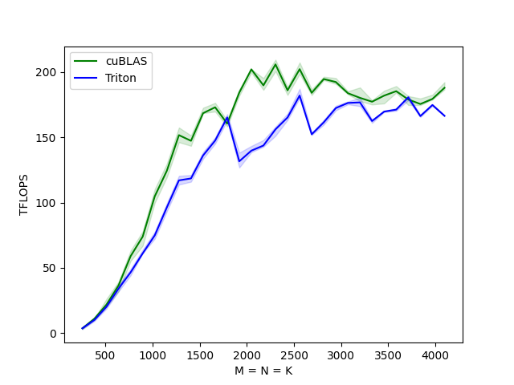

# Kernel

## CUDA

### SGEMM
✅ Naive

✅ Thread Tiling

✅ Thread Tiling Bank Free


### SGEMV
✅ Naive

✅ Warp Reduce

### Reduce

### Transpose

### Sort
✅ MergeSort

### Softmax
✅ Naive

✅ WarpReduce


## Triton

### HGEMM
✅ Block Tiling



### GEMV

### Reduce

### Transpose

### Sort

### Softmax


## Build

```bash
python3 ./script.py {kernelName}
```

## Dependence
+ NVIDIA GPU
+ OpenAI Triton >= 2.0