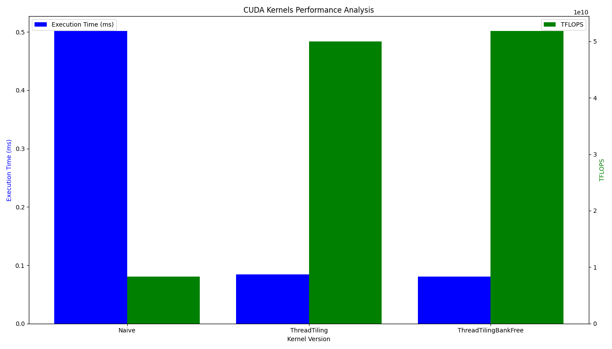

# Kernel

## CUDA

### SGEMM
+ Naive
+ ThreadTiling



### GEMV
### Reduce
### Transpose
### Sort
+ MergeSort
### Softmax
+ Naive
+ WarpReduce


## Triton

### SGEMM
### GEMV
### Reduce
### Transpose
### Sort
### Softmax


## Build

```bash
python3 ./script.py {kernelName}
```

## Dependence
+ NVIDIA GPU
+ OpenAI Triton >= 2.0